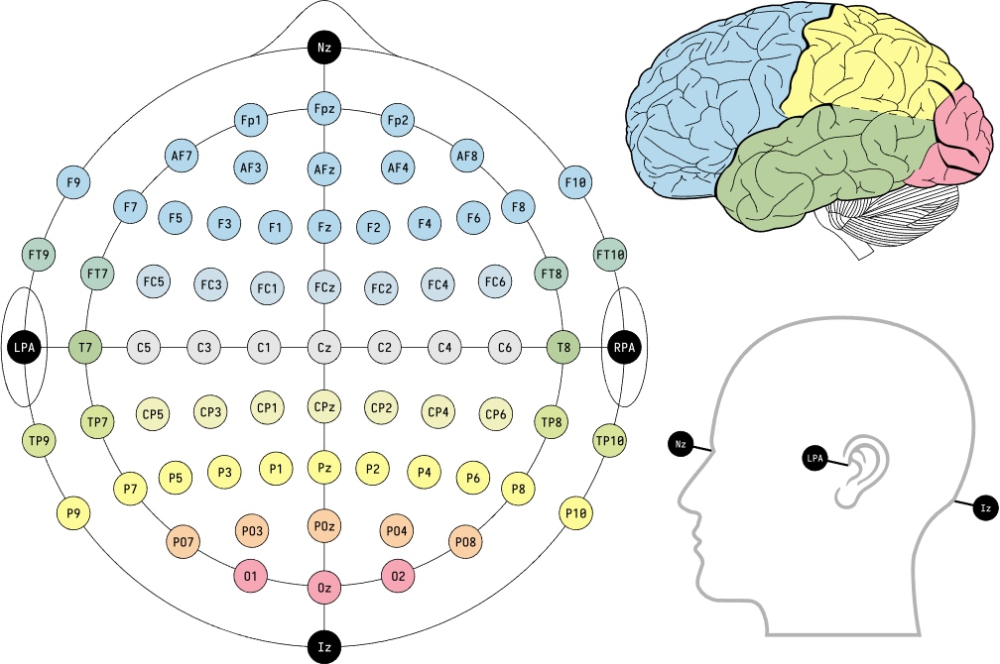

.. Documnet of DEEG documentation master file, created by
   sphinx-quickstart on Thu Aug  5 12:41:44 2021.
   You can adapt this file completely to your liking, but it should at least
   contain the root `toctree` directive.

Feature Extraction
============================================

Temporal features
-----------------------

* Kurtosis

kurtosis is a statistical measure that is used to describe distribution. Kurtosis measures extreme values in either tail. Distributions with large kurtosis exhibit tail data exceeding the tails of the normal distribution. Distributions with low kurtosis exhibit tail data that are generally less extreme than the tails of the normal distribution.

The kurtosis is the fourth standardized moment, 

.. math::

   kurtosis = \frac{\sum_{i=1}^{N}(Y_{i} - \bar{Y})^{4}/N}
      {s^{4}}

* Skewness

Skewness is a measure of symmetry, or more precisely, the lack of symmetry. A distribution, or data set, is symmetric if it looks the same to the left and right of the center point.

For univariate data Y1, Y2, ..., YN, the formula for skewness is:

.. math::

   g_{1} = \frac{\sum_{i=1}^{N}(Y_{i} - \bar{Y})^{3}/N} {s^{3}}

* Mean Absolute Deviation (MAD)

The Mean Absolute Deviation (MAD) of a set of data is the average distance between each data value and the mean. The mean absolute deviation is the "average" of the "positive distances" of each point from the mean. The larger the MAD, the greater variability there is in the data (the data is more spread out). The MAD helps determine whether the set's mean is a useful indicator of the values within the set. The larger the MAD, the less relevant is the mean as an indicator of the values within the set.

The mean absolute deviation of a set :math:`{x_{1}, x_{2}, ..., x_{n}}`

.. math::

   MAD = \frac{1}{n}\sum_{i=1}^{n}|x_{i} - \overline{x}|

where the :math:`x_{i}` is the :math:`n` original observations and :math:`\overline{x}` is the mean of the series.

Here is an example calculating kurtosis, skewness, mean absolute deviation using :func:`deeg.features.kurtosis`, :func:`deeg.features.skewness`, and :func:`deeg.features.mean_absolute_deviation` on NeuroMarketing dataset.

.. jupyter-execute::

   import deeg 
   import os

   path = os.path.abspath('.') + '/Data-EEG-25-users-Neuromarketing/'
   data, labels = deeg.load_NeuroMarketing(path)
   data_Kurt = deeg.features.kurtosis(data)
   data_Skew = deeg.features.skewness(data)
   data_MAD = deeg.features.mean_absolute_deviation(data)
   print("Original data shape: {}".format(data.shape))
   print("Data shape after kurtosis feature extraction: {}".format(data_Kurt.shape))
   print("Data shape after skewness feature extraction: {}".format(data_Skew.shape))
   print("Data shape after mean absolute deviation feature extraction: {}".format(data_MAD.shape))

Frequency features
-----------------------

* Differential Entropy (DE)

   Differential entropy is used to measure the complexity of a continuous random variable and is the entropy of continuous random variable. Differential entropy is also related to minimum description length. Its calculation formula can be expressed as,

.. math::

   h(X)=-\int_{X}f(x)\log(f(x))dx 

where :math:`X` is a random variable, :math:`f(x)` is the probability density function of :math:`X`. 
It can be found that EEG signals are subject to Gaussian distribution nearly in a series of subbands after band-pass filtering from 2Hz to 44Hz by every 2Hz step, and we assume that EEG signal is normal-distributed.For the time series :math:`X` obeying the Gauss distribution :math:`N(μ,σ2)`, its differential entropy can be defined as,

.. math::

   h(X) = -\int_{-\infty}^{\infty}\frac{1}{\sqrt{2\pi\sigma^2}}e^{-\frac{(x-\mu)^2}{2\sigma^3}}\log(\frac{1}{\sqrt{2\pi\sigma^2}}e^{-\frac{(x-\mu)^2}{2\sigma^3}})dx

.. math::

   =\frac{1}{2}\log(2\pi e\sigma^{2}) 

Here is an example calculating differential entropy using :func:`deeg.features.differential_entropy` on NeuroMarketing dataset.

.. jupyter-execute::

   import deeg 
   import os

   path = os.path.abspath('.') + '/Data-EEG-25-users-Neuromarketing/'
   data, labels = deeg.load_NeuroMarketing(path)
   data_DE = deeg.features.differential_entropy(data)
   print("Original data shape: {}".format(data.shape))
   print("Data shape after differential entropy feature extraction: {}".format(data_DE.shape))
   

* Power Spectral Density (PSD)

The Welch Method is an useful method in calculating PSD, in which the EEG signal is split into segmentation and PSD for each segment is estimated and these local estimates are averaged.

Let's assume that we split the signal :math:`x[k]` into :math:`L` overlapping segments :math:`x_{l}[k]` of length N with :math:`0\leq l\leq L-1`, starting at multiples of the stepsize :math:`M\in 1,2,...,N`. These segments are then windowed by the windowed by the window :math:`w[k]` of length :math:`N`, resulting in a windowed :math:`l-th` segment. The discrete time Fourier transformation (DTFT) :math:`X_{l}(e^{j\Omega})` of the windowed :math:`l-th`segmenta is thus given as:

.. math::

   X_{l}(e^{j\Omega}) = \sum_{k=0}^{N-1}x[k+l\cdot M]w[k]e^{-j\Omega k}

where the window math:`w[k]` defined within :math:`0\leq l\leq L-1` should be normalized as :math:`\frac{1}{N}\sum_{k=0}^{N-1}|w[k]|^2=1`. The stepsize :math:`M` determines the overlap between the segments. In general :math:`N-M` number of sample overlaps overlap between adjacent segments, for :math:`M=N` no overlap occurs. The overlap is sometimes given as ratio :math:`\frac{N-M}{N}\cdot 100` %.

Introducing :math:`X_{l}(e^{j\Omega})` into the definition of the periodogram yields the periodogram of the :math:`l-th` segment

.. math::

   \hat{\Phi}_{xx,l}(e^{j\Omega}) = \frac{1}{N}|X_{l}(e^{j\Omega})|^2

The estimated PSD is then given by averaging over the segment's periodograms :math:`\hat{\Phi}_{xx,l}(e^{j\Omega})`

.. math::
   
   \hat{\Phi}_{xx,l}(e^{j\Omega}) = \frac{1}{L}\sum_{l=0}^{L-1}\hat{\Phi}_{xx,l}(e^{j\Omega})
   
Here is an example using :func:`deeg.process.band` and :func:`deeg.features.power_spectral_density` on NeuroMarketing dataset.

.. jupyter-execute::

   import deeg 
   import os

   path = os.path.abspath('.') + '/Data-EEG-25-users-Neuromarketing/'
   data, labels = deeg.load_NeuroMarketing(path)
   data_band = deeg.process.band(data)
   data_PSD = dict()
   for band in data_band:
       data_PSD[band] = deeg.features.power_spectral_density(data_band[band], 128, 256)
       print("Original data shape of {} band: {}".format(band, data_band[band].shape))
       print("Data shape of {} band after feature extraction: {}".format(band, data_PSD[band].shape))

Multichannel features
-----------------------

Lateralization between the left and right hemisphere, and spectral differences along frontal and posterior brain regions are associated with emotions. Here we developed differential asymmetry (RASM), and differential caudality (DCAU) methods in multichanel feature extraction.

Here is the EEG cap layout for 73 channels:

Left-right hemispheric asymmetry electrodes are: Fp1-Fp2, AF7-AF8, AF3-AF4, AF9-AF10, F7-F8, F5-F6, F3-F4, F1-F2, FT9-FT10, FT7-FT8, FC5-FC6, FC3-FC4, FC1-FC2, LPA-RPA, T7-T8, C5-C6, C3-C4, C1-C2, TP9-TP10, TP7-TP8, CP5-CP6, CP3-CP4, CP1-CP2, P9-P10, P7-P8, P5-P6, P3-P4, P1-P2, PO7-PO8, PO3-PO4, O1-O2.

Frontal-posterior hemespheric asymmetry electrodes are: Nz-lz, Fp1-O1, Fpz-Oz, Fp2-O2, AF7-PO7, AF3-PO3, Afz-POz, AF4-PO4, AF8-PO8, F9-P9, F7-P7, F5-P5, F3-P3, F1-P1, Fz-Pz, F2-P2, F4-P4, F6-P6, F8-P8, F10-P10, FT9-TP9, FC5-CP5, FC3-CP3, FC1-CP1, FCz-CPz, FC2-CP2, FC4-CP4, FC6-CP6, FT8-FT10, TP10.

* Differential asymmetry (DASM)

The differences between the DE features of hemispheric asymmetry electrodes 

.. math:

   DASM = DE(X_{left}) - DE(X_{right})

Here is an example using :func:`deeg.features.differential_asymmetry` on NeuroMarketing dataset:

.. jupyter-execute::

   import deeg 
   import os

   path = os.path.abspath('.') + '/Data-EEG-25-users-Neuromarketing/'
   data, labels = deeg.load_NeuroMarketing(path)
   channel_name = ['AF3', 'F7', 'F3', 'FC5', 'T7', 'P7', 'O1', 'O2', 'P8', 'T8', 'FC6', 'F4', 'F8', 'AF4']
   data_DASM = deeg.features.differential_asymmetry(data, channel_name)
   print("Original data shape: {}".format(data.shape))
   print("Data shape after feature extraction: {}".format(data_DASM.shape))

* Rational asymmetry (RASM)

The ratios between the DE features of hemispheric asymmetry electrodes 

.. math:

   DASM = DE(X_{left}) / DE(X_{right})

* Differential caudality (DCAU)

The the differences the differences between DE features of frontal-posterior electrodes

.. math:

   DCAU = DE(X_{frontal}) / DE(X_{posterior})

References
-------------

https://bcmi.sjtu.edu.cn/~zhujiayi/pdf/NER2013.pdf
https://ieeexplore.ieee.org/document/6611075
https://zhuanlan.zhihu.com/p/67583198

